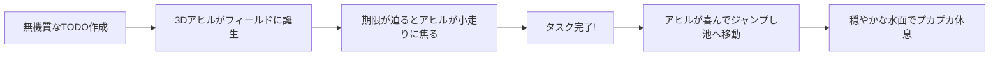
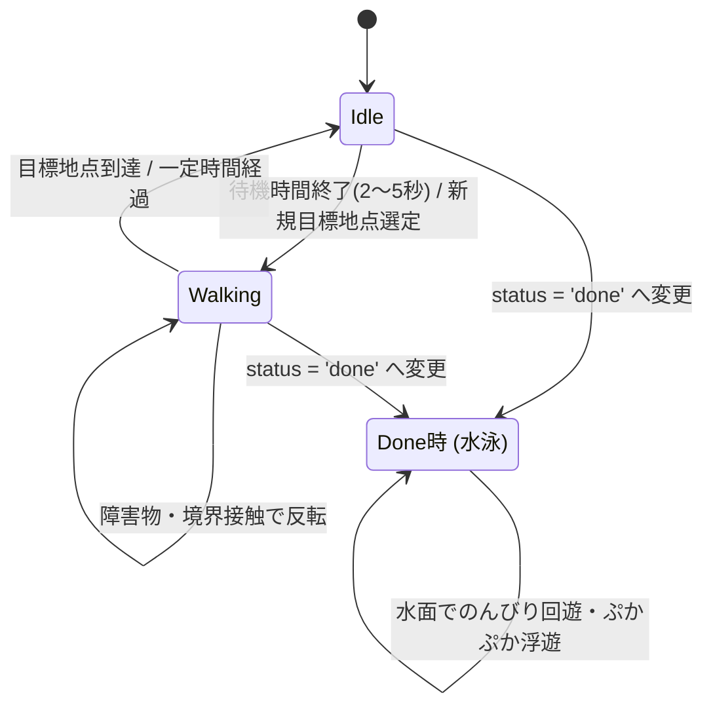

# 製品仕様書 (Product Specification)

# QuackTrack (3D Isometric Duck Task Manager)

**文書バージョン**: 1.0.0  
**作成日**: 2026-10-06  
**作成者**: Alex (Product Manager)  
**対象ステークホルダー**: Architecture, Frontend Engineering, Rapid Prototyping, QA / Test Automation  
**ステータス**: Approved (Phase 0 完了 / 設計・プロトタイプ開始可能)

---

## 1. プロダクト概要・ビジョン (Product Overview & Vision)

### 1.1 背景と課題
従来のタスク管理ツール（Trello, Notion, Todoistなど）は、機能的である反面、テキストやカードの羅列になりがちです。未消化タスクが積み上がると「開くこと自体がストレス」「締め切りの赤文字に追われて自己肯定感が下がる」という認知的負担（Task Anxiety）を生み出します。

### 1.2 コアビジョン
> **「無機質なタスクリストを、生命感あふれるアヒルの庭園へ」**

QuackTrack は、登録したタスクが愛らしい「アヒル（Duck）」の3Dキャラクターとしてアイソメトリック（等角投影）の庭園フィールドをトコトコと自律歩行する新感覚のタスク管理Webアプリケーションです。

タスクを管理する行為そのものを「アヒルたちのお世話」へとリフレーミングし、タスクを完了させることは「アヒルを幸せにして池で休ませてあげること」というポジティブな報酬体験を提供します。

### 1.3 コアバリュー
1. **Emotional Delight（愛着と癒やし）**: タスクが可愛いアヒルとして動き回ることで、日々の作業に癒やしと遊び心を提供。
2. **Intuitive Urgency（直感的な締め切り認知）**: 締め切りが迫るとアヒルの足取りが小走りになり、羽をパタパタさせるなど、視覚的・直感的に優先度を認知できる。
3. **Zero Friction & Zero Cost（導入摩擦ゼロ・運用費0円）**: ログイン不要、ブラウザを開いた瞬間に利用可能。全データはブラウザローカルに安全に保存され、完全静的ホスティングで運用可能。



---

## 2. 想定ユーザー・ペルソナ (Target Users & Personas)

### 2.1 メインターゲット
- 日常的にタスク管理ツールを使っているが、義務感やストレスを感じている個人ユーザー
- デスクトップ環境でPC作業を長時間行うエンジニア、デザイナー、ライター、学生
- Cozy Games（どうぶつの森、Tamagotchi、Chillhop等）のような温かみのある世界観を好む層

### 2.2 ペルソナ定義

#### ペルソナ 1: ゆうき（28歳・リモートワーク Webエンジニア）
- **プロフィール**: フルリモートで自室での開発作業が中心。ブラウザのサブ画面に常に作業メモやTODOを表示している。
- **ペインポイント**: 
  - JiraやGitHub Projectsでの仕事管理に疲れており、プライベートの個人開発や雑務まで業務ライクなツールで管理したくない。
  - 締め切りを忘れたくないが、通知に追われるとストレスを感じる。
- **QuackTrackに求めること**:
  - サブディスプレイに開いておくだけで癒やされるアンビエントな画面。
  - アカウント登録なしで即座に使え、データが手元の端末内で完結する気軽さ。

#### ペルソナ 2: あやか（21歳・大学生 / クリエイター）
- **プロフィール**: 授業の課題やイラスト制作の締め切り管理をしている。
- **ペインポイント**:
  - TODOリストを作っても三日坊主で放置してしまう。
  - タスクを消したときの手応えが薄く、モチベーションが維持できない。
- **QuackTrackに求めること**:
  - タスクを完了したときにアヒルが喜んで池に飛び込むような「目に見えるご褒美感」。
  - 見た目の可愛らしさと直感的な操作性。

---

## 3. 機能要件 (Functional Requirements)

### 3.1 タスク管理・データモデル仕様

#### 3.1.1 データエンティティ定義 (`Task`)

| フィールド名 | 型 | 必須 | デフォルト値 | 説明・バリデーション |
| :--- | :--- | :--- | :--- | :--- |
| `id` | `string` | 必須 | UUID v4 / nanoid | 一意の識別子 |
| `title` | `string` | 必須 | なし | タスク名（1〜100文字。前後の空白はトリム。空文字不可） |
| `description` | `string` | 任意 | `""` | 詳細メモ（最大1,000文字） |
| `status` | `TaskStatus` | 必須 | `'todo'` | 状態: `'todo'` \| `'in-progress'` \| `'done'` |
| `priority` | `TaskPriority` | 必須 | `'medium'` | 優先度: `'low'` \| `'medium'` \| `'high'` |
| `dueDate` | `string \| null` | 任意 | `null` | 期限日時（ISO 8601形式: `YYYY-MM-DDTHH:mm:ss.sssZ`） |
| `duckColor` | `string` | 任意 | ランダムパステル色 | アヒル固有の基本色コード（HEXカラー） |
| `createdAt` | `string` | 必須 | 現在時刻（ISO） | 作成日時 |
| `updatedAt` | `string` | 必須 | 現在時刻（ISO） | 最終更新日時 |
| `completedAt` | `string \| null` | 任意 | `null` | 完了日時（`done` 移行時にセット、未完了時は `null`） |

#### 3.1.2 タスクCRUD機能
1. **タスク作成 (Create)**:
   - UIパネルの「+ タスク追加」ボタン、またはショートカットキーからモーダル/フォームを開いて入力。
   - タイトルのみで即時作成可能（クイック作成対応）。期限・詳細は後から追加可能。
   - 作成と同時に、3D空間上のスポーン地点に新しいアヒルが出現する。
2. **タスク一覧・閲覧 (Read)**:
   - サイドパネルのリスト表示（タブ切り替え:「すべて」「未完了」「完了」）。
   - キーワード検索（タイトル・詳細の部分一致）、ソート機能（期限順、作成日順、優先度順）。
3. **タスク編集 (Update)**:
   - タイトル、詳細、状態、優先度、期限の変更が可能。
   - 状態を変更すると、3D空間上のアヒルの見た目・行動エリアが即座に同期変化する。
4. **タスク削除 (Delete)**:
   - タスク削除時は確認プロンプト（または復元可能なToast通知）を表示。
   - 削除されたタスクのアヒルは、煙のパーティクルとともにポフッとフェードアウト消滅する。

---

### 3.2 3Dアイソメトリック空間・カメラ仕様

#### 3.2.1 空間・ワールド構造
3D空間は「緑豊かな野原（Roam Field）」と「穏やかな池（Peaceful Pond）」からなる箱庭（Diorama）形状とします。

```
+-------------------------------------------------------+
|                 [3D Isometric Diorama]                |
|                                                       |
|   +--------------------------+   +----------------+   |
|   |                          |   |                |   |
|   |     草原エリア           |   |   池エリア     |   |
|   |    (Roam Field)          |   |  (Pond Area)   |   |
|   |                          |   |                |   |
|   |  [todo] [in-progress]    |   |    [done]      |   |
|   |   アヒルが歩き回る       |   |  アヒルが泳ぐ  |   |
|   |                          |   |  (水面・蓮)    |   |
|   +--------------------------+   +----------------+   |
|                 木製フェンス / 小石の境界線           |
+-------------------------------------------------------+
```

- **座標領域 (ワールド境界)**:
  - フィールド全体: $X \in [-12, 12], Z \in [-12, 12]$
  - 草原エリア（Todo / In-Progress）: $X \in [-12, 3], Z \in [-10, 10]$
  - 池エリア（Done）: $X \in [5, 12], Z \in [-8, 8]$ （水面シェーダーまたは半透明マテリアル）
  - 境界オブジェクト: 草原と池の間に小さな木製フェンスや飛び石を配置。
- **ビジュアルスタイル**:
  - ローポリゴン（Low-poly）、フラットシェーディングまたは柔らかなグラデーションテクスチャ。
  - 温かみのあるパステル調（草色のミントグリーン、空・池のスカイブルー、柔らかな日差し）。
  - ディレクショナルライト（太陽光・ソフトシャドウ）＋ 環境光（Ambient Light）。

#### 3.2.2 カメラ仕様
- **投影方式**: 正射投影カメラ（`OrthographicCamera`）または狭角の遠視投影（`PerspectiveCamera`, FOV 30°〜40°による擬似アイソメトリック）。
- **デフォルト配置**:
  - 視野角度: 斜め上角約 35.264°（クォータービュー）、Y軸回転 45°
  - 対象注視点（LookAt）: 原点 $(0, 0, 0)$
- **カメラ操作インタラクション**:
  - **パン移動**: マウス右ボタンドラッグ / 中ボタンドラッグ（または2本指スワイプ）。移動範囲はワールド境界外に出ないようクランプ。
  - **ズーム**: マウスホイール / ピンチイン・アウト（最小・最大ズーム率を制限）。
  - **回転（オービット）**: 左右各30°以内の微小チルトに制限し、アイソメトリックの整然とした構図を維持。
  - **リセットボタン**: 画面上の「視点リセット」ボタンで初期アングルへ滑らかにイージング復帰。
  - **アヒル追従フォーカス**: UIまたは3D上のアヒル選択時、カメラがそのアヒルの現在位置へスムーズにLerp（線形補間）移動。

---

### 3.3 アヒルの振る舞い・状態表現・歩行速度連動アルゴリズム

#### 3.3.1 アヒルの外観モデリング
- 低ポリゴンで構築された親しみやすいアヒル形状（頭、くちばし、まるい胴体、小さな翼、オレンジの足）。
- タスク固有の `duckColor`（デフォルトはレモンイエロー、ユーザー指定またはランダム色）がマテリアルに反映される。
- 頭上に小さな「タスクタイトルタグ（3D BillBoardまたはHTMLオーバーレイ）」を控えめに表示（設定で表示/非表示切替可能）。

#### 3.3.2 ステータス別ビジュアル＆アクセサリー表現

| タスク状態 (`status`) | 配置エリア | 外観・アクセサリー装飾 | アニメーション動作 |
| :--- | :--- | :--- | :--- |
| **`todo`** (未着手) | 草原エリア | スタンダードな姿。黄色またはパステル色の無垢なアヒル。 | 通常のよちよち歩行。時々立ち止まって首をかしげる。 |
| **`in-progress`** (進行中) | 草原エリア | 赤いハチマキ（作業バンダナ）または小さなプロペラ付き帽子を着用。 | キビキビと歩く。前傾姿勢で意欲的なポーズ。 |
| **`done`** (完了) | 池エリア | 頭に金色の王冠、またはサングラス、首に浮き輪を装着。周囲にキラキラパーティクル。 | 池の水面を優雅にスイスイ泳ぐ。波紋エフェクト。時々水面に顔をつける。 |

#### 3.3.3 自律歩行ステートマシン (Wander AI)
各アヒルは自律的に以下の状態遷移を行います。



1. **`IDLE` (停止待機)**:
   - 2〜5秒間その場で静止。
   - アイドル時演出: 尾羽を左右にフリフリ、地面をつつく（Pecking）、たまに小さく「クワッ」と鳴くモーション。
2. **`WALKING` (歩行移動)**:
   - 現在のエリア境界内からランダムな目的地 $(X_{target}, Z_{target})$ を選定。
   - 目的地に向かって回転（Slerp補間）。
   - よちよち歩きアニメーション（左右に身体をロッキングしながら前進、足の交互回転）。
   - 他のアヒルと接近しすぎた場合は、簡易的な反発力（Separation vector）を適用して重なりを緩和。
3. **`SWIMMING` (遊泳)**:
   - `status = 'done'` のアヒル専用ステート。
   - 池エリア内をゆっくりと直線・円弧を描いて泳ぐ。足は見えず、水面に同心円の波紋（Ripple）が発生。

#### 3.3.4 期限（DueDate）と歩行速度・演出の連動アルゴリズム

残り時間 $T_{remain} = T_{due} - T_{now}$ （ミリ秒）に基づき、歩行速度係数 $V_{multiplier}$、足振りアニメーション速度 $A_{speed}$、および感情エフェクトを動的に決定します。

##### 速度・演出決定ルール表:

| 残り時間 $T_{remain}$ | 速度倍率 $V_{multiplier}$ | アニメーション倍率 $A_{speed}$ | 感情・エフェクト表現 | 状態説明 |
| :--- | :--- | :--- | :--- | :--- |
| **期限なし** | $1.0\times$ | $1.0\times$ | なし | のんびりマイペース |
| **48時間以上** | $1.0\times$ | $1.0\times$ | なし | 余裕たっぷり（通常歩行） |
| **24時間〜48時間** | $1.3\times$ | $1.3\times$ | なし | やや早足 |
| **4時間〜24時間** | $1.8\times$ | $1.8\times$ | 青ざめ汗マーク（たまに頭上に出現） | 焦り気味のパタパタ歩行 |
| **0時間〜4時間** | $2.5\times$ | $2.5\times$ | 汗マーク＋羽ばたき＋小走り | 直前パニック！必死の猛ダッシュ |
| **期限超過 (Overdue)** | $2.0\times$ | $2.0\times$ | 怒りマーク/湯気エフェクト、足踏み | 怒りのプンプク歩行 / アラート強調 |
| **完了 (`done`)** | $0.6\times$ | $0.6\times$ | 満足マーク（♪やハート） | 締め切り解除。極上のリラックス |

> [!NOTE]
> タスクが `done` になった瞬間、期限の判定は無視され、穏やかな遊泳速度へと固定されます。これにより「タスクを完了させるとアヒルが安心する」という心理的フィードバックが成立します。

---

### 3.4 UIと3Dインタラクション仕様

#### 3.4.1 画面レイアウト構成
ブラウザ全体を3Dビューポート（WebGL Canvas）が占有し、その上に操作用の2D UIレイヤーがオーバーレイ配置されます。

```
+-------------------------------------------------------------------------+
| [QuackTrack 🦆]    [頭数: 未完 5羽 / 済 12羽]     [🔊][📷リセット]  [+ 新規] |  <- ヘッダーバー
+-------------------------------------------------------------------------+
| [タスク一覧パネル]   |                                                    |
| 検索: [_________]   |                                                    |
| [全][未完][完了]    |                 3D ISOMETRIC CANVAS                |
|                     |                                                    |
| * 企画書作成 [!]    |          🦆 (todo)                                 |
| * バグ修正   [>>]   |                  🦆 (in-progress, ハチマキ)        |
| * 掃除       [✓]    |                                                    |
|                     |                                 ~~~~~~~~~~~~~~~~   |
| [パネル格納ボタン]   |                                 ~~ 🦆 (done) ~~~   |
+---------------------+----------------------------------------------------+
```

#### 3.4.2 3D空間とUIの双方向連動 (Bidirectional Sync)
1. **3Dアヒル → UIへの連動**:
   - **マウスホバー**: アヒルのマテリアルにアウトライン発光（Rim/Outlineエフェクト）。カーソルが `pointer` に変化。簡易ツールチップ（タスク名、期限）がマウス近傍にフロート表示。
   - **マウスクリック**:
     - アヒルが「クワッ！」と一瞬軽くホップ（ジャンプ）。
     - カメラがアヒルにスムーズフォーカス。
     - サイドパネルまたは詳細ドロワーが自動展開され、該当タスクの編集フォームが開く。
2. **UIタスクリスト → 3D空間への連動**:
   - **リストアイテムホバー**: 3D空間内の対応するアヒルの頭上に「▼」の黄色いインジケーターが出現し、アヒルが注目ポーズをとる。
   - **リストアイテムクリック**: カメラがそのアヒルの位置へパン移動。

#### 3.4.3 タスク完了セレブレーション（達成演出）
UI上のチェックボックスをクリック、または詳細画面で「完了」を選択した瞬間、以下の演出が連続実行されます。

1. **ファンファーレ音**: Web Audio API による軽快な「クワッ・ピロリン♪」という達成ジングルが再生（ミュート設定時は無音）。
2. **セレブレーションジャンプ**: アヒルがその場で嬉しそうにクルッと一回転宙返りジャンプ。
3. **パーティクル発生**: アヒルの足元から紙吹雪（Confetti）またはハート型のパーティクルが空中に舞い散る。
4. **池へのパタパタ大行進**: アヒルが羽を広げて池エリアへ向かって一直線に移動し、池に「ポチャン！」と飛び込んで王冠を被り、優雅な遊泳モードに移行する。

---

### 3.5 データ保存・永続化仕様

#### 3.5.1 ストレージ方針
- **保存先**: ブラウザの `localStorage`（バックエンド通信なし・完全クライアント完結）。
- **ストレージキー**: `quacktrack_tasks_v1`
- **保存形式**: JSONシリアライズ文字列
- **スキーマバージョン**: `version: 1` を保持し、将来のスキーマ拡張時にマイグレーション可能な構造とする。

```typescript
interface StorageSchemaV1 {
  version: 1;
  lastUpdated: string; // ISO 8601
  tasks: Task[];
  settings: {
    soundEnabled: boolean;
    showTitleTags: boolean;
    cameraFollowMode: boolean;
  };
}
```

#### 3.5.2 自動保存と復元
- タスクの追加・編集・削除・ステータス更新の都度、即座にローカルストレージへ同期保存。
- ページリロード時、ローカルストレージから即時に全タスクデータを復元し、草原および池エリアにアヒルを再配置。

#### 3.5.3 初回起動シードデータ (Onboarding Seed Data)
ローカルストレージに既存データが存在しない初回アクセス時、空の寂しい状態を避けるため、以下のチュートリアル用アヒル（3羽）を自動投入します。

1. **タスク1 (Todo)**: 「QuackTrackへようこそ！🦆 アヒルをクリックして詳細を見てね」
2. **タスク2 (In-Progress)**: 「タスクを完了にしてみて！池で泳ぎ始めるよ✨」（ハチマキ着用）
3. **タスク3 (Done)**: 「チュートリアル完了！🎉」（すでに池で王冠を被ってプカプカ泳いでいる）

#### 3.5.4 バックアップ＆移行 (Export / Import)
- **JSONエクスポート**: 設定メニューから全タスクデータを `.json` ファイルとしてローカルにダウンロード可能。
- **JSONインポート**: 保存したバックアップファイルをドラッグ＆ドロップまたはファイル選択で読み込み、復元可能。

---

## 4. 受入基準 (Acceptance Criteria)

QAおよびE2Eテストが機械的・客観的に検証できるよう、Given-When-Then形式で定義します。

### AC-01: タスク作成とアヒルの出現
- **Given**: アプリケーションが開かれ、草原エリアが表示されている。
- **When**: UIの「新規タスク」からタイトル `レポート作成` を入力して作成ボタンを押す。
- **Then**: 
  - タスクリストに `レポート作成`（Status: `todo`）が即時追加される。
  - 草原エリアに新しいアヒルがポフッと出現し、自律歩行を開始する。
  - ローカルストレージに新しいタスクデータが保存される。

### AC-02: 3Dアヒルのクリックと詳細UIの同期
- **Given**: 草原エリアにアヒルが存在している。
- **When**: 3Dビューポート上のアヒルをクリックする。
- **Then**:
  - アヒルが小さくホップし、カメラがアヒルを中心視野に捉える。
  - サイドパネルが展開され、対応するタスクのタイトルと詳細情報が編集可能な状態で表示される。

### AC-03: ステータス変更とビジュアル・配置の連動
- **Given**: 草原エリアに `todo` 状態のアヒルが存在する。
- **When**: タスクのステータスを `in-progress` に変更する。
- **Then**:
  - アヒルの頭部にハチマキ（またはプロペラ帽子）が装着される。
  - 歩行速度がキビキビとした速度に切り替わる。
- **When**: タスクのステータスを `done` に変更する。
- **Then**:
  - 紙吹雪パーティクルが発生し、アヒルがジャンプする。
  - アヒルが池エリアへ移動し、王冠またはサングラスを身につけて水面遊泳状態（波紋エフェクト付き）に切り替わる。

### AC-04: 締め切り連動アルゴリズムの動作
- **Given**: タスクに期限が設定されている。
- **When**: 期限までの残り時間が4時間を切る（または開発用デバッグ時刻設定で4時間未満にする）。
- **Then**:
  - アヒルの歩行速度が通常時の2.5倍の猛ダッシュになり、頭上に汗エフェクトが表示される。
- **When**: タスクを `done` に完了させる。
- **Then**:
  - 猛ダッシュと汗エフェクトが即時解除され、穏やかな遊泳速度（通常時の0.6倍）に移行する。

### AC-05: データ永続性とリロード復元
- **Given**: ユーザーがタスクを3件（todo 1件、in-progress 1件、done 1件）登録している。
- **When**: ブラウザのページを再読み込み（F5 / Cmd+R）する。
- **Then**:
  - 画面復元後、UIリストに3件のタスクが同一の状態で復元されている。
  - 3D空間上に3羽のアヒルが復元され、2羽が草原、1羽が池に正しく配置されて動作を再開する。

### AC-06: カメラ操作と境界制限
- **Given**: 3Dキャンバスが表示されている。
- **When**: 右ボタンドラッグでパン移動、ホイールでズーム操作を行う。
- **Then**:
  - 視点がスムーズに移動し、指定された最小・最大ズーム範囲外へは拡大・縮小されない。
  - 「視点リセット」ボタンをクリックすると、初期のアイソメトリック位置へスムーズに戻る。

---

## 5. 非機能要件 (Non-Functional Requirements)

### 5.1 パフォーマンス要件
- **フレームレート**:
  - 一般的なノートPC（Intel Iris Xe / Apple M1 / M2等）環境で **常時 60 FPS** を目標とする。
  - 同時に最大30羽のアヒルが存在する状態でも **30 FPS以上** を維持すること。
- **レンダリング最適化**:
  - アヒルの3Dモデルはジオメトリ共有（InstancedMeshの活用または同一ジオメトリ再利用）によりドローコールを抑制。
  - 画面外または極小表示時のLOD（Level of Detail）や不要なアニメーション計算のスキップ。
- **バンドルサイズ**:
  - 初期ロード時のJSバンドルサイズは Gzip圧縮後 2.0MB 以下（Three.js含む）。
  - First Contentful Paint (FCP) は一般的なネットワーク環境で 1.5 秒以内。

### 5.2 レスポンシブ＆画面設計
- **推奨環境**: PCデスクトップブラウザ（幅 1280px 以上、1920x1080フルHD最適化）。
- **タブレット・モバイル対応**:
  - 画面幅 768px 未満の端末では、サイドパネルをデフォルト非表示（フローティングアイコンでドロワー開閉）。
  - タッチ操作（1本指ドラッグで選択、2本指ドラッグでパン、ピンチでズーム）に対応。

### 5.3 ブラウザ互換性
- WebGL 2.0 をサポートするモダンブラウザ:
  - Google Chrome (最新版)
  - Apple Safari (最新版, macOS & iOS)
  - Mozilla Firefox (最新版)
  - Microsoft Edge (最新版)

### 5.4 アクセシビリティ・UX配慮
- **視覚的認知の多重化**:
  - 期限の危険度やタスク状態は、色（赤/緑/青）だけでなく、アクセサリー・表情・エフェクト・歩行アニメーションの形状変化によって表現し、色覚多様性に配慮する。
- **音声コントロール**:
  - 初回起動時はデフォルトで音声ミュート。画面右上に明瞭な音声ON/OFFトグルを配置。
- **キーボードナビゲーション**:
  - 3D操作が困難な場合でも、UIサイドパネル上で `Tab` / `Enter` / `Esc` 等のキーボード操作のみでタスクの追加・編集・完了・削除が完全に実行可能であること。

### 5.5 アーキテクチャ＆ホスティング制約
- **完全静的配信**:
  - サーバーサイドの動的処理を一切持たない静的SPA（Single Page Application）。
  - GitHub Pages, Vercel, Netlify, Cloudflare Pages 等の無料ホスティング枠で運用可能（月額サーバーコスト 0円）。

---

## 6. スコープ外事項 (Non-Goals)

本バージョン（v1）において、意図的に開発対象から除外する項目を明確にします。

1. **ユーザー認証・アカウント登録**:
   - メールアドレス認証、Google OAuth等のログイン機能は実装しない。
2. **クラウドデータベース・専用バックエンド**:
   - PostgreSQL, MongoDB, Firebase等の外部DBへの接続は行わない（全データをクライアントローカルに保持）。
3. **マルチユーザー・リアルタイム共同編集**:
   - WebSocketやCRDTによる複数人での共同作業スペース機能は含まない。
4. **重厚な剛体物理シミュレーション**:
   - アヒル同士の複雑な剛体衝突（ラグドール物理）は行わず、軽量な平面幾何計算による反発・境界判定とする。
5. **ネイティブモバイルアプリ**:
   - App Store / Google Play 向けのネイティブアプリビルドは対象外（Web標準ブラウザ対応のみ）。

---

## 7. 今後の拡張アイデア (Future Scope / Roadmap)

v1のローンチおよびユーザー検証を経て、将来的なアップデートで検討するアイデア群です。

- **🦆 アヒルの着せ替え・ショップ機能**:
  - タスクを完了するごとに「羽毛コイン（Feather Coins）」を獲得。
  - コインを使って、魔法使いの帽子、メガネ、リボン、様々なアヒルの毛色（カモ、黒鳥など）をアンロック。
- **🌦️ 天候・昼夜サイクルシステム**:
  - 実際の時刻に応じた夕暮れ・夜景モード（ランタンの灯りが灯る）。
  - 雨の日はアヒルたちがハスの葉の傘をさして歩くアンビエント演出。
- **⏱️ ポモドーロタイマー連動 (Focus Mode)**:
  - 25分の集中時間中、選択したタスクのアヒルがユーザーの傍で一緒に本を読んだりパソコンをカタカタ叩く演出。
- **🎵 リラックスBGM・サウンドスケープ**:
  - 小川のせせらぎ、優しい雨音、Lo-Fi HipHop調の環境音楽の選択再生。
- **☁️ オプショナル・クラウド同期**:
  - ユーザー自身の Google Drive または iCloud / WebDAV を利用したプライベート同期。
- **📱 PWA (Progressive Web App) 対応**:
  - デスクトップアプリ感覚でインストールし、オフラインでも起動可能にする。

---

## 8. ドキュメント承認・改訂履歴

| バージョン | 日付 | 変更者 | 変更内容 |
| :--- | :--- | :--- | :--- |
| **1.0.0** | 2026-10-06 | Alex (Product Manager) | 初版作成。Phase 0ヒアリング結果に基づく全仕様の策定。 |
